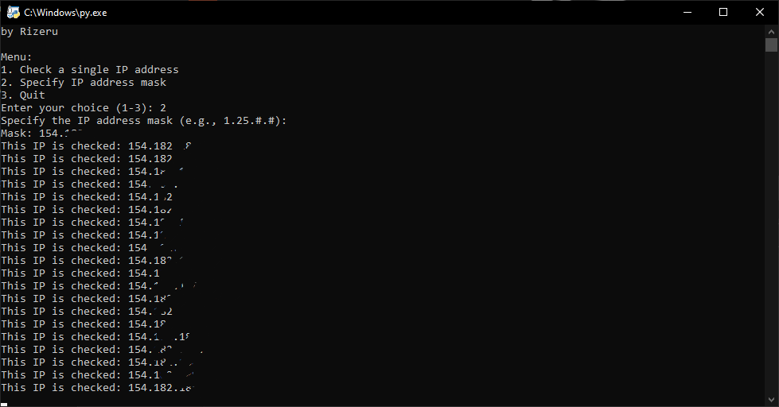
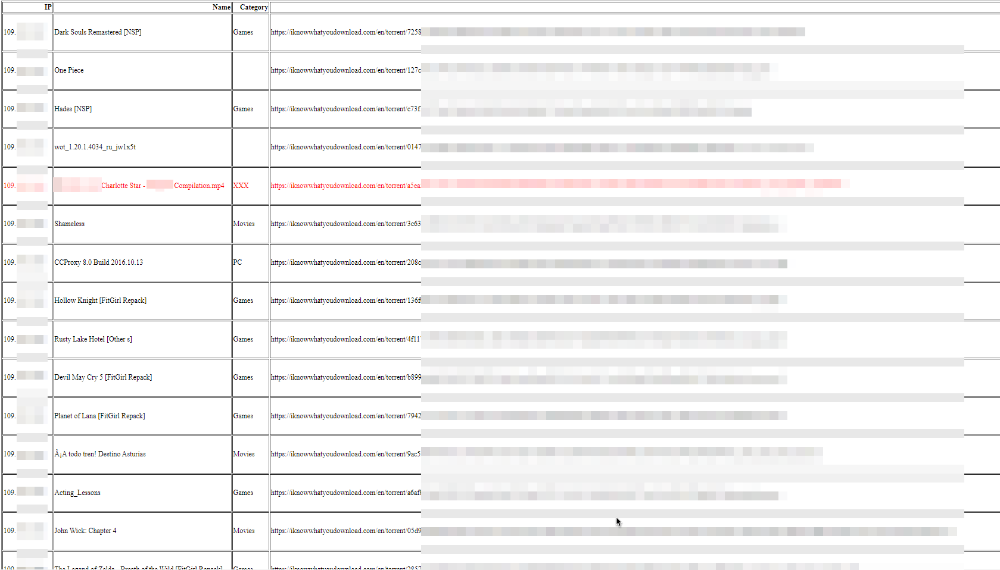

# IpTorrentInfo
This Python script provides the ability to retrieve information about IP addresses associated with torrent downloads using the [iknowwhatyoudownload](https://iknowwhatyoudownload.com/en/peer/) service. The script allows you to automate the process of collecting data about downloads that have been linked to a certain IP address.

After running the script, the output is saved in an html table where you can analyze the data
# Installation
1. Clone the repository:
```
git clone https://github.com/ElRizeru/IpTorrentInfo.git
```
2. Navigate to the project directory:
```
cd IpTorrentInfo
```
3. Install the required dependencies:
```
pip install -r requirements.txt
```
Or just run `start.bat`
# Usage
To use IpTorrentInfo, do this:
* Run the main.py script:
```
python main.py
```
# Screenshot


